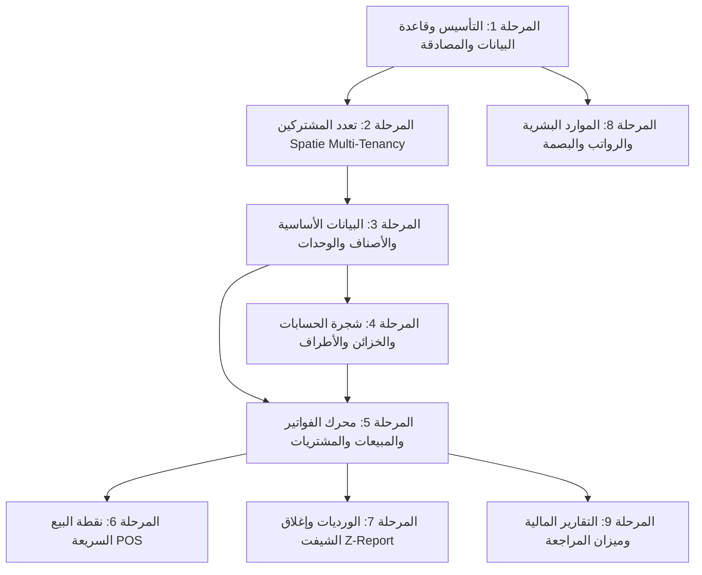

# وثيقة وخطة الانتقال التدريجي إلى Laravel 11/12 (Kody Migration Plan)

هذه الوثيقة تمثل الخطة الهندسية والمرجع الأساسي لمشروع إعادة بناء وتطوير نظام **Kody ERP & POS** على بيئة عمل حديثة ومستقلة تماماً في مسار:
`C:\xampp\htdocs\kody-laravel`

---

## 1. القرارات المعمارية المعتمدة (Architectural Decisions)

| المجال | القرار المعتمد | السبب والفوائد |
| :--- | :--- | :--- |
| **نمط الانتقال (Pattern)** | **Strangler Fig (مشروع جانبي مستقل)** | الحفاظ على عمل النظام القديم وتشغيل النشاط بدون أي توقف (Zero Downtime / Zero Risk). |
| **قاعدة البيانات (Database)** | **Shared Database (`kody26`)** | ربط الـ Eloquent Models بنفس الجداول القائمة لمطابقة الحسابات والمخزون لحظياً. |
| **تعدد المشتركين (Multi-Tenancy)** | **`spatie/laravel-multitenancy`** | عزل تام لبيانات كل شركة/مشترك تلقائياً عبر `BelongsToTenant` trait بالاعتماد على حقلي `tenant` و `branch`. |
| **واجهة المستخدم (Frontend Stack)** | **Inertia.js + Vue 3 SPA + Tailwind CSS** | تجربة Single Page Application عصرية، سريعة جداً، وبدون أي اعتماد على Livewire. |
| **الطباعة ونقاط البيع (POS)** | **Vue 3 Specialized Cashier Screen** | استجابة فورية لمسح الباركود، اختصارات لوحة المفاتيح (F2, F4, F9)، وطباعة إيصالات حرارية (Thermal ESC/POS). |

---

## 2. خريطة المراحل وجدول الإنجاز (Migration Roadmap & Progress)

### الحالة التنفيذية للمراحل:

| المرحلة | اسم الموديول | المكونات التقنية المنفذة | الحالة |
| :---: | :--- | :--- | :---: |
| **1** | **الأساس والمصادقة (Foundation & Auth)** | إعداد Laravel 12، ربط `.env` بـ `kody26`، نماذج `User.php` و `Role.php` مع تشفير Bcrypt المتوافق. | ✅ **مكتمل** |
| **2** | **تعدد المشتركين (Spatie Multi-Tenancy)** | تثبيت `spatie/laravel-multitenancy`، ترحيل جدول `tenants`، بناء `BelongsToTenant` trait، و `FlexibleTenantFinder`. | ✅ **مكتمل** |
| **3** | **الأصناف والمخزون (Items & Inventory)** | نماذج `Item.php` و `ItemUnit.php` و `ItemGroup.php` و `Unit.php`، خدمة `ItemService.php`، شاشة Vue 3 كاملة في `/items`. | ✅ **مكتمل** |
| **4** | **دليل الحسابات والأطراف (Accounts & Parties)** | نموذج `Account.php` (مرتبط بـ `acc_head`)، خدمة `AccountService.php`، شاشة Vue 3 لعرض الشجرة والعملاء والموردين والخزائن في `/accounts`. | ✅ **مكتمل** |
| **5** | **نقطة البيع السريعة (Vue 3 POS)** | شاشة سبليت فائقة السرعة للكاشير في `/pos`، مسح فوري للباركود، اختصارات لوحة المفاتيح، وحاسبة الدفع السريع. | ✅ **مكتمل** |
| **6** | **محرك الفواتير والمبيعات (Core Invoicing)** | نماذج `Invoice.php` (`ot_head`) و `InvoiceItem.php` (`fat_details`)، خدمة `InvoiceService.php` بحماية `DB::transaction()`. | ✅ **مكتمل** |
| **7** | **الورديات وإغلاق الشيفت (Shifts & Z-Report)** | نموذج `ClosedShift.php` (`closed_orders`)، خدمة حساب مبيعات الشيفت، تسجيل العجز والزيادة، وتوليد تقرير Z. | ✅ **مكتمل** |
| **8** | **الموارد البشرية والرواتب (HR & Payroll)** | الموظفين، الحضور والانصراف، البصمة، احتساب مسير الرواتب والخصومات والبدلات. | ✅ **مكتمل** |
| **9** | **التقارير المالية والتحليلات (Reports & General Ledger)** | كشف الحساب، ميزان المراجعة، الأرباح والخسائر، تقارير حركة المبيعات والمخزون الراكد. | ✅ **مكتمل** |

---

## 3. تفاصيل المكونات والنماذج المشتركة (Shared Data Mapping)

| النموذج الجديد (Laravel) | الجدول في قاعدة البيانات القديمة (`kody26`) | الوصف والوظيفة |
| :--- | :--- | :--- |
| `App\Models\Tenant` | `tenants` | إدارة المشتركين والشركات مع كود المشترك ونطاقه. |
| `App\Models\User` | `users` | مستخدمو النظام مع الصلاحيات ودعم الويترز (`is_waiter`). |
| `App\Models\Role` | `usr_pwrs` | مصفوفة أدوار وصلاحيات الشاشات والعمليات. |
| `App\Models\Item` | `myitems` | الأصناف الرئيسية، التكلفة، الأسعار، ورصيد المخزن. |
| `App\Models\ItemUnit` | `item_units` | تعدد وحدات الصنف الواحد والباركودات المستقلة ومعامل التحويل. |
| `App\Models\ItemGroup` | `item_group` | تصنيفات ومجموعات الأصناف. |
| `App\Models\Unit` | `myunits` | الوحدات المرجعية (قطعة، كيلو، كرتونة...). |
| `App\Models\Account` | `acc_head` | دليل وشجرة الحسابات الموحد (أصول، خصوم، عملاء، موردين، خزائن، بنوك، مصروفات). |
| `App\Models\Invoice` | `ot_head` | رأس الفواتير (مبيعات، مشتريات، مردودات، أوامر، عروض أسعار). |
| `App\Models\InvoiceItem` | `fat_details` | بنود وتفاصيل الفواتير وحركات المخزن الواردة والمنصرفة. |
| `App\Models\ClosedShift` | `closed_orders` | سجلات إغلاق الورديات وتقارير Z اليومية للكاشير. |

---

## 4. معايير الجودة والأمان البرمجي (Security & Clean Code Standards)

1. **سلامة المعاملات (Database Transactions):**
   * جميع العمليات المركبة (مثل حفظ فاتورة مع بنودها مع حركتها المخزنية) تتم داخل `DB::transaction()` لضمان التراجع التلقائي في حال حدوث أي خطأ.
2. **عزل المشتركين التلقائي (Automatic Multi-Tenant Scoping):**
   * عبر `App\Traits\BelongsToTenant`، يتم حقن شرط `where('tenant', Tenant::current()->id)` تلقائياً في كل استعلام دون تدخل يدوي.
3. **التحقق الصارم من المدخلات (Strict Validation):**
   * فحص فرادة الباركودات على مستوى الصنف وجميع وحداته لمنع تكرار أو تعارض قراءة الماسح الضوئي.
4. **أداء الواجهة (Frontend Performance):**
   * بناء جميع شاشات Vue 3 باستخدام Vite لتقليل حجم الحزم وسرعة التصفح اللحظية.
